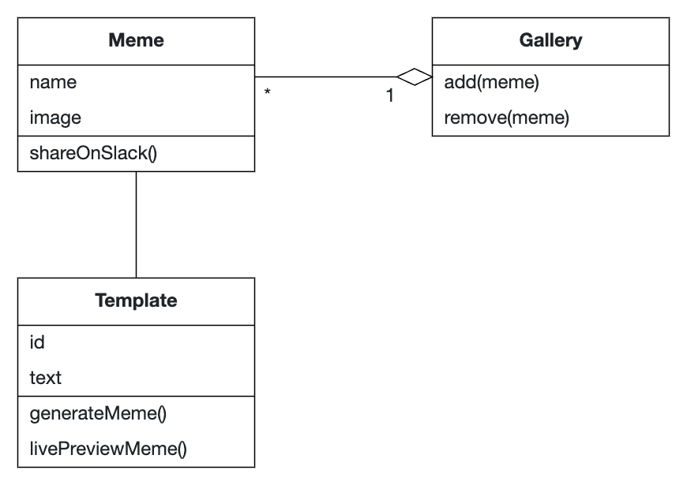
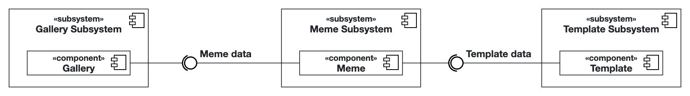

# Intro Course Project App of Simon Huang for the iPraktikum

To pass the intro course, you need to create your own unique iOS app (based on SwiftUI).

There are no requirements regarding the functions of your app, so you can get creative.
However, we provide you with Non-Functional Requirements (NFR) that your app needs to fulfill.

After each day of learning new Swift and SwiftUI concepts, these NFRs may change, or new NFRs get added.

## Submission procedure

You get a **personal repository** on Gitlab to work on your app.

Once you implemented a new feature into your app, you need to create a Merge Request (MR - Sometimes we will also reference these as "Pull Requests"(PR)) to merge your changes from the feature branch into your main branch.

Your tutor will review your changes and either request changes or approves the MR.

If your MR got approved, you also need to merge it!

### Deadline: **09.04.2024 23:59**

Until the deadline all of your PRs **need to be merged** and your final app **needs to fulfill** all of the requested NFRs!

---

## Problem Statement (max. 500 words)

In the ipraktikum pre-course, participants seek engaging ways to enhance their learning experience and foster camaraderie within their cohort through humor and creativity. 
However, the process of generating entertaining content, such as memes, proves time-consuming and requires specialized skills in image editing software.
Additionally, the absence of a centralized platform to save and retrieve created memes complicates the process, leading to frustration and disengagement among participants.

To adress these challenges, I, as a participant of the iPraktikum, want to have an iOS application that allows me to easily create memes and share them via Slack, providing users with a seamless and enjoyable experience during the pre-course.
The app streamlines meme creation, facilitate storage and retrieval of generated content. 
As a user I want to be able to create memes from templates, view a gallery of previously generated memes, save memes to the phone gallery, and optionally share it on slack with a single button.

Optionally streamlining meme generation using generative AI would be a very helpful feature so I can use less of my mental capacity to create memes.

## Requirements

### Functional requirements

As a student, I need an application to help me create and share memes.

I want to be able to:

- 😄 ...browse meme templates and select them
- 🎨 ...create Memes from templates
- 🖼️ ...view previously generated memes in a Gallery.
- 💾 ...save memes to my phone image gallery.

Optionally it would be good for me to be able to:
- 🤖 ...generate texts using a ML model for future use in memes, based on a prompt that I enter.
- 📤 ...post memes to Slack as images.

### Non-Functional requirements
- Constraint: App should have 5 +- 2 custom swift UI views
- Constraint: App should follow [human-interface-guidelines](https://developer.apple.com/design/human-interface-guidelines/)
- Constraint: App should support dark mode
- Constraint: App should follow  [Swift API Design guidelines](https://www.swift.org/documentation/api-design-guidelines/)
- Performance Optimization: The app should load and respond to user interactions swiftly, with a maximum response time of 5 second for any action
- Usability: The app should have an intuitive user interface that shows the user any view within three tabs or clicks

## Analysis

<!-- https://apollon.ase.in.tum.de/WI1bEztvV2iahy5HMKUI?view=EDIT -->

## System Design

## Product Backlog

| ID     | Name                          | Priority |
|--------|-------------------------------|----------|
| SIM-57 | Add gallery view              | Critical |
| SIM-58 | Add saving to phone for memes | Major    |
| SIM-59 | Add image generation using ai | Minor    |
| SIM-60 | Add text generation using ai  | Minor    |
| SIM-61 | Add sharing of memes to slack | Minor    |
